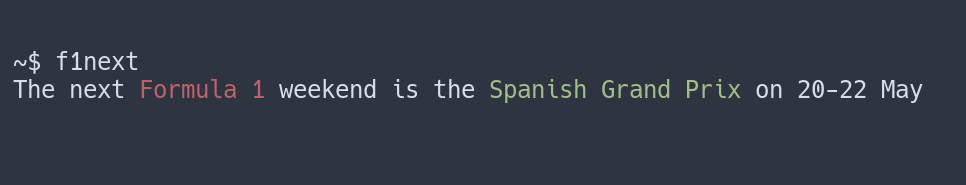
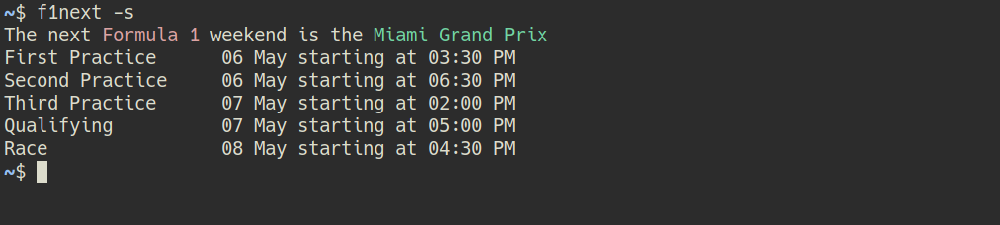

# F1NEXT

A simple python script that prints the dates of the next Formula 1 Grand Prix.
It uses [Ergast API](https://ergast.com/mrd/terms/) and includes cache to reduce API calls.

## Usage

`f1next` will print the name and date of the next Formula 1 Grand Prix.

Use the `-f` or `--force-download` flag to refresh the cache.
The cache lasts for 24 hours, so information about the next Grand Prix might be wrong while another Grand Prix is taking place.

The `-s` or `--schedule` flag will print the full schedule for the weekend, instead of only showing the first and last dates.
It uses local time for the detected timezone.

The `-c` or `--countdown` flag will also print a countdown in days to the next event. If the event starts in less than 48 hours, it will also print hours and minutes left.

All the options can be used together in any combination. 

    f1next -sc
    f1next -s
    f1next -c

The script uses `click.echo()` to print out information. If you pipe the output to a file, colors won't be included.

## Notes

This is a simple hobby project. My main goal was to get familiarity with `python`, `click` and `git`. 
Feel free to open an issue if you have any feedback or features suggestions.

### TODO

- [X] Weekend Schedule 
- [ ] Publish on PyPI
- [ ] Error handling 
- [ ] Option to display more information about the GP 
- [ ] Countdown to closest event 
- [ ] Emoji Flag 
