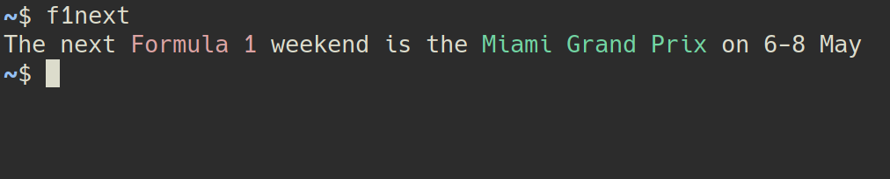
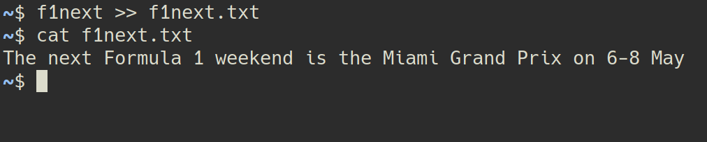

# F1NEXT
--------

A simple python script that prints the dates of the next Formula 1 Grand Prix.
It uses [Ergast API](https://ergast.com/mrd/terms/) and includes cache to reduce API calls.

## Usage

`f1next` will print the name and date of the next Formula 1 Grand Prix.

Use the `-f` or `--force-download` flag to refresh the cache.
The cache lasts for 24 hours, so information about the next Grand Prix might be wrong while another Grand Prix is taking place.

The script uses `click.echo` to print out information. If you pipe the output to a file, colors won't be included.

## Notes

This is a simple hobby project. My main goal was to get familiarity with `python`, `click` and `git`. 
Feel free to open an issue if you have any feedback or features suggestions.

### TODO

[ ] - Error handling
[ ] - Option to display more information about the GP
[ ] - Weekend Schedule
[ ] - Countdown to closest event
[ ] - Emoji Flag
