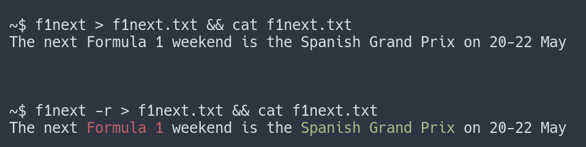

# F1NEXT

A simple python script that prints the dates of the next Formula 1 Grand Prix.
It uses [Ergast API](https://ergast.com/mrd) and includes cache to reduce API calls.


## Usage

```

Usage: f1next [OPTIONS]

  Simple script that shows you information about the next F1 Grand Prix

Options:
  -h, --help                 Show this message and exit.
  -f, --force-download       Force cache to be refreshed.
  -s, --schedule             Show the schedule for all events in the weekend.
  -c, --countdown            Show countdown to the next event
  -i, --circuit-information  Show circuit name and country
  
```


`f1next` will print the name and date of the next Formula 1 Grand Prix.

Use the `-f` or `--force-download` flag to refresh the cache.
The cache lasts for 24 hours, so information about the next Grand Prix might be wrong while another Grand Prix is taking place.

The `-s` or `--schedule` flag will print the full schedule for the weekend, instead of only showing the first and last dates.
It uses local time for the detected timezone.


The `-c` or `--countdown` flag will also print a countdown in days to the next event. If the event starts in less than 48 hours, it will also print hours and minutes left.

The `-i` or `--circuit-information` flag will print the race circuit name, city and country.

All the options can be used together in any combination and order, except for `-h, --help`.

    f1next -sc
    f1next -s
    f1next -c
    f1next -isc
    f1nxt -si

The script uses `click.echo()` to print out information. If you pipe the output to a file, colors won't be included.




## Notes

This is a simple hobby project. My main goal was to get familiarity with `python`, `click` and `git`. 
Feel free to open an issue if you have any feedback or features suggestions.

### TODO

- [x] Weekend Schedule 
- [x] Countdown to closest event 
- [x] Option to display more information about the GP 
- [ ] Publish on PyPI
- [ ] Error handling
- [ ] Change main function to facilitate testing

### Possible features

- [x] Add `-h` shortcut for help message
- [x] Scheadule table with better formating
- [ ] Include round number
- [ ] Better color output (grey out past events)
- [ ] Verbose option for debugging
- [ ] Option to open the wikipedia link for the circuit/event
- [ ] ~~Emoji Flag~~
